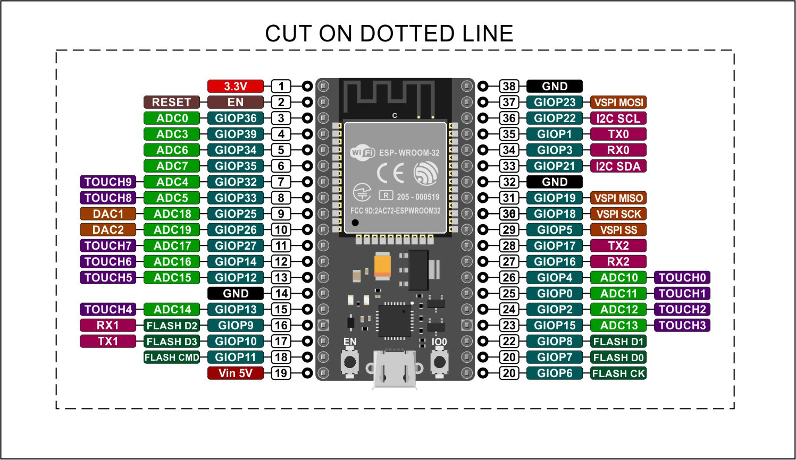

# Desktop Clock

A desktop digital clock built using an ESP32 microcontroller, Max7219 led metrix display, and Ardunio lang

Uses [this MAX7219 library](https://github.com/squix78/MAX7219LedMatrix)

## Contributions

### Third-party libraries

- Open Arduino IDE > preferences, note the sketchbook location
- `cd <sketchbook location>/libraries`
- `git clone https://github.com/squix78/MAX7219LedMatrix.git`

### Tool Dependencies

Just the Arduino IDE
[Arduino IDE](https://www.arduino.cc/en/main/software#download)

Board manager URLs - one off config
`http://arduino.esp8266.com/stable/package_esp8266com_index.json`
`https://dl.espressif.com/dl/package_esp32_index.json`

Using VS Code

[Arduino VS Code extension](https://marketplace.visualstudio.com/items?itemName=vsciot-vscode.vscode-arduino)
Depends on the Arduino IDE

### Uploading a sketch in VS Code

Upload from VS Code: `option + command + u`

## ESP-WROM-32 devkit pinout schema

